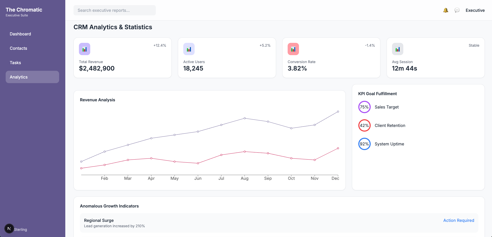

# 📊 Chromatic Dashboard

A modern, responsive CRM analytics dashboard built with **Next.js 15**, **Tailwind CSS**, and **Recharts**.

---

## 🚀 Features

* 📈 Revenue analytics chart
* 📊 KPI metrics cards
* 📉 Conversion & user tracking
* 🧠 Anomaly detection panel
* 📱 Responsive layout
* 🎨 Clean, modern UI with Tailwind CSS

---

## 🖼️ UI Preview




---

## 🏗️ Tech Stack

* Next.js 15 (App Router)
* React
* Tailwind CSS
* Recharts

---

## 📂 Project Structure

```
src/
├── app/
│   ├── layout.jsx
│   ├── page.jsx
│   └── dashboard/
│       └── page.jsx
│
├── components/
│   ├── layout/
│   │   ├── Sidebar.jsx
│   │   └── Header.jsx
│   │
│   ├── dashboard/
│   │   ├── MetricsGrid.jsx
│   │   ├── RevenueChart.jsx
│   │   ├── KPISection.jsx
│   │   └── AnomalyList.jsx
│
├── styles/
│   └── globals.css
```

---

## ⚙️ Installation

```bash
# Clone repo
git clone https://github.com/your-username/your-repo.git

# Navigate into project
cd your-repo

# Install dependencies
npm install

# Run development server
npm run dev
```

---

## 🌐 Usage

Open your browser and go to:

```
http://localhost:3000/dashboard
```

---

## 📦 Dependencies

* recharts
* tailwindcss
* postcss
* autoprefixer

---

## ✨ Customization

You can easily:

* Modify colors in `tailwind.config.js`
* Update chart data in `RevenueChart.jsx`
* Add new dashboard widgets in `components/dashboard/`

---


4. Commit and push to GitHub

---

## 🧑‍💻 Author

Syed Hassan Tayyab

---

